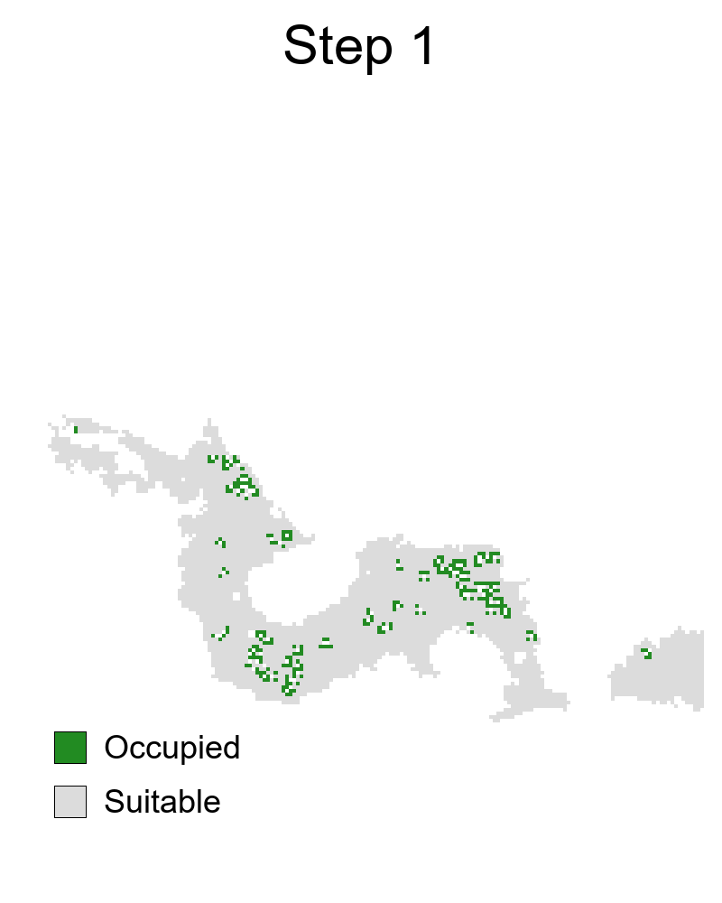
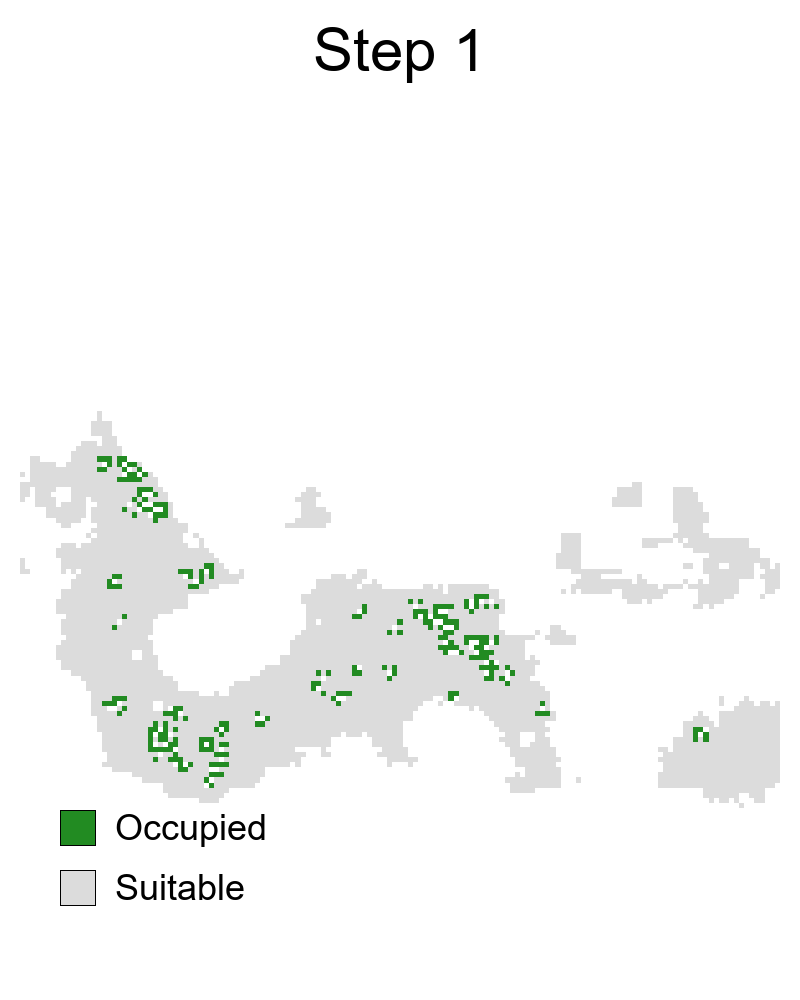
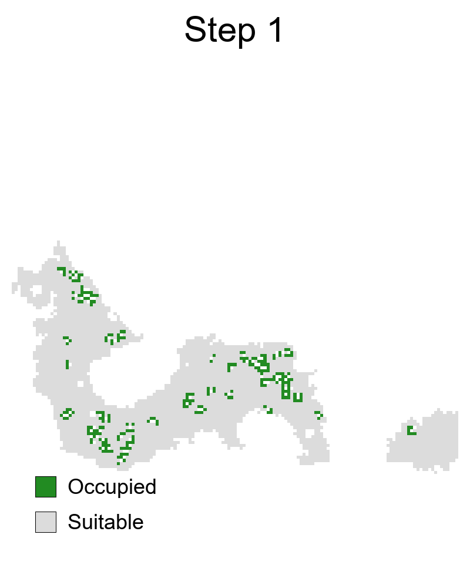
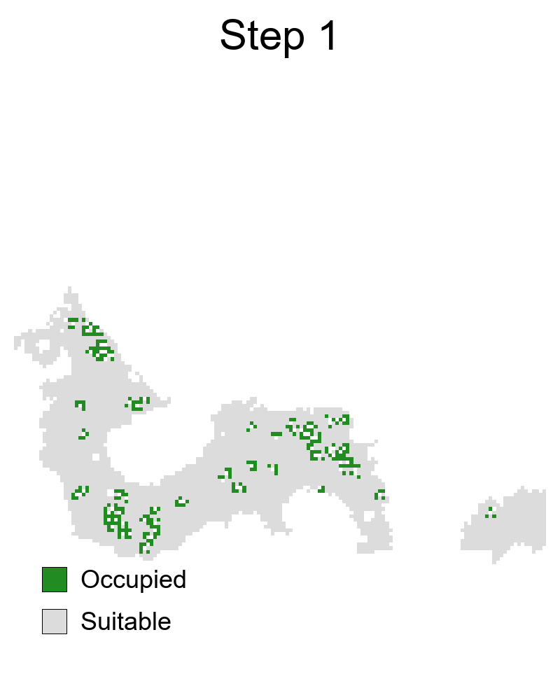
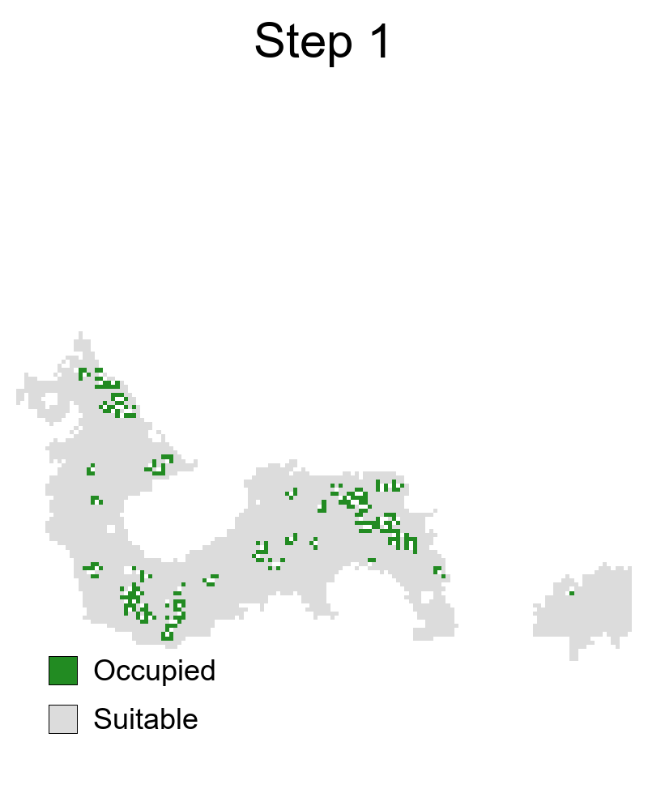

# Assessment of the biogeographic filters delimiting the distribution of *Macrocopturus aguacatae* (Coleoptera: Curculionidae) in the Americas
Mariano Altamiranda-Saavedra, Carlos Patron-Rivero, Carlos Yáñez-Arenas

Repository author: Carlos Patron-Rivero

The html and codes are available in: # https://patronriveroc.github.io/M_aguacatae

<table>
  <tr>
    <td align="center"><b>Truncation AM</b> </td>
    <td align="center"><b>Clamping AM</b> </td>
    <td align="center"><b>Extrapolation AM</b> </td>
  </tr>
  <tr>
    <td align="center"><b>Truncation relaxed-BAM</b> </td>
    <td align="center"><b>Clamping relaxed-BAM</b> </td>
    <td align="center"><b>Extrapolation relaxed-BAM</b> </td>
  </tr>
  <tr>
    <td align="center"><b>Truncation restricted-BAM</b> </td>
    <td align="center"><b>Clamping restricted-BAM</b> </td>
    <td align="center"><b>Extrapolation restricted-BAM</b> </td>
  </tr>
</table>

Please cite:

Altamiranda-Saavedra, M., Patron-Rivero, C., Yáñez-Arenas, C. (2026). Assessment of the biogeographic filters delimiting the distribution of *Macrocopturus aguacatae* (Coleoptera: Curculionidae) in the Americas. In preparation.
